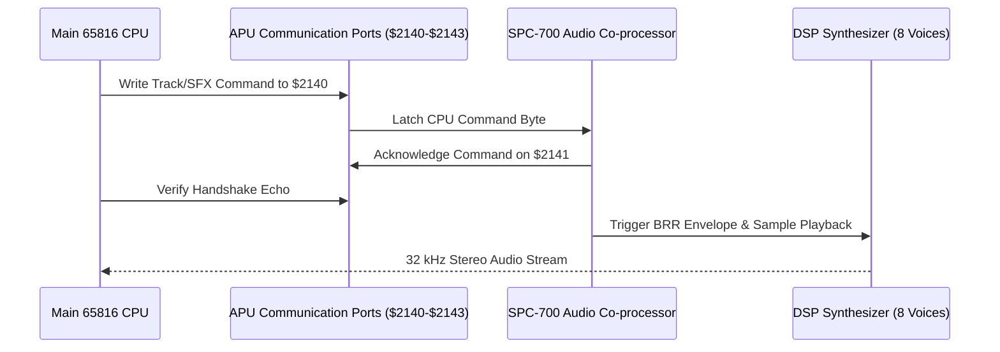

# ISSD Native — SPC-700 Sound Engine & Voice Synthesis

This document details the audio architecture, SPC-700 communication protocol, music tracks, sound effects, and digitized announcer voice samples in *International Superstar Soccer Deluxe Native*.

---

## 1. Sound Subsystem Architecture

The SNES audio subsystem runs independently on a dedicated Sony SPC-700 8-bit CPU coupled with a 16-bit DSP synthesizer, backed by 64 KB of Audio RAM (ARAM).

In *ISSD Native*, this is executed in real-time via `spc_player.c` and synchronized deterministically with the video frame pacing (`RtlRenderAudio`).

---

## 2. APU Port Protocol & Handshake

Communication between the main CPU and the SPC-700 occurs through 4 hardware registers:
- **`$2140` (Command / Music Register):** Writes BGM track selection or master sound commands.
- **`$2141` (Echo / Handshake Register):** Returns status acknowledgments from the SPC-700 driver.
- **`$2142` (SFX Channel 1 / Sample Register):** Sound effect triggers.
- **`$2143` (SFX Channel 2 / Volume Register):** Secondary audio effects and pan settings.

### Auto-Ack Fallback in Host Runtime
During high CPU load or headless simulation runs, the host engine provides an auto-acknowledge safety net in `ISSDNative/main.c` (`[apu] port echo timeout auto-acked`) to ensure that missing SPC cycles never hang the main 65816 execution thread.

---

## 3. Background Music (BGM) Catalog

Music is triggered via `CODE_80BF05` (`ISSD_ADDR_PLAY_BGM_TRACK`):

| ID | Constant | Scene / Event |
| :---: | :--- | :--- |
| `$0000` | `ISSD_BGM_KONAMI_SCREEN` | Opening Konami splash screen fanfare |
| `$0004` | `ISSD_BGM_STAFF_ROLL` | Credits / staff roll roll-out music |
| `$000C` | `ISSD_BGM_SCENARIO_CLEAR` | Victory theme upon completing a scenario |
| `$0010` | `ISSD_BGM_INTRO_CUTSCENE` | Fast-paced opening cinematic theme |
| `$0014` | `ISSD_BGM_MAIN_MENU` | Main menu navigation groove |
| `$0018` | `ISSD_BGM_INTERNATIONAL_CUP` | International Cup menu & group schedule |
| `$001C` | `ISSD_BGM_WORLD_SERIES` | World Series league standings theme |
| `$0020` | `ISSD_BGM_SCENARIO_MENU` | Scenario selection theme |
| `$0024` | `ISSD_BGM_TRAINING_MENU` | Training mode hub |
| `$0028` | `ISSD_BGM_PRACTICE_MATCH` | In-match training theme |
| `$0038` | `ISSD_BGM_GAME_OVER` | Game over screen |
| `$003C` | `ISSD_BGM_SHORT_LEAGUE` | Short League championship theme |

---

## 4. Digitized Announcer Voices & BRR Samples

*International Superstar Soccer Deluxe* was famous for its extensive digitized voice commentary. Voice lines are encoded in Sony's Bit-Rate Reduction (BRR) ADPCM format.

### Streamed Title Screen Name Drop (`CODE_80BF76`)
At the start of the title screen (`$8BD295`), the game invokes `CODE_80BF76` with sample ID `$000C` (`ISSD_STREAMED_TITLE_DROP`) to stream the iconic title voice:
> *"International Superstar Soccer... DELUXE!"*

### In-Game Commentator Lines
Triggered dynamically during match events based on referee whistles, shots, and player collisions:

| ID | Commentator Voice Line | Trigger Condition |
| :---: | :--- | :--- |
| `$0001` | **"Corner Kick"** | Ball crossed goal line off defender |
| `$0002` | **"Goal Kick"** | Ball crossed goal line off attacker |
| `$0003` | **"Throw In"** | Ball crossed touchline |
| `$0004` | **"Free Kick"** | Minor foul committed |
| `$0005` | **"Penalty Kick"** | Foul committed inside penalty box |
| `$0006` | **"Offside"** | Attacker caught in offside position |
| `$0007` | **"Replay"** | Instant replay cinematic triggered |
| `$0008` | **"Half Time"** | 45-minute whistle blown |
| `$0009` | **"Injury Time"** | Stoppage time announced |
| `$000A` | **"Great Save!"** | Goalkeeper blocks high-danger shot |
| `$000D` | **"Great Cross"** | High ball delivered into the penalty box |
| `$000F` | **"Great Tackle!"** | Clean slide tackle winning possession |
| `$0010` | **"On The Volley!"** | Striking ball in mid-air |
| `$0013` | **"You Lose"** | Match defeat |
| `$0014` | **"You Win"** | Match victory |
| `$0015` | **"Match Draw"** | Regulation ended level |
| `$0027` | **"Kickoff"** | Match begins or resumes after goal |
| `$0028` | **"Foul!"** | Referee whistles infraction |
| `$0029` | **"Yellow Card"** | Caution given to player |
| `$002A` | **"Red Card"** | Ejection for serious foul |
| `$002B` | **"He's Off!"** | Sent-off player walks off the pitch |
| `$002C` | **"He Shoots!"** | High-velocity shot on goal |
| `$002F` | **"Goal!"** | Normal goal scored |
| `$0032` | **"Own Goal"** | Defender scores into own net |
| `$0043` | **"Time Up"** | Full time whistle |
| `$0046` | **"GOOOOOOOOOOOOAAAAAALLLLLL!"** | Long screamer / dramatic goal scored |
| `$0048` | **"Dog Bark"** | Easter egg / dog running onto pitch |
