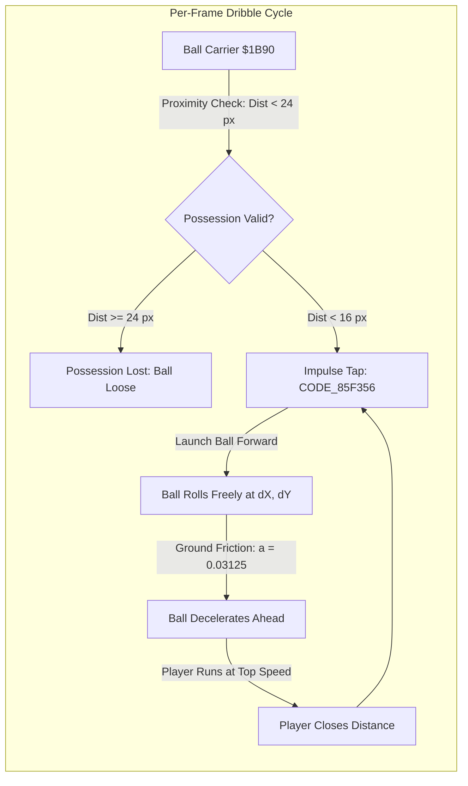
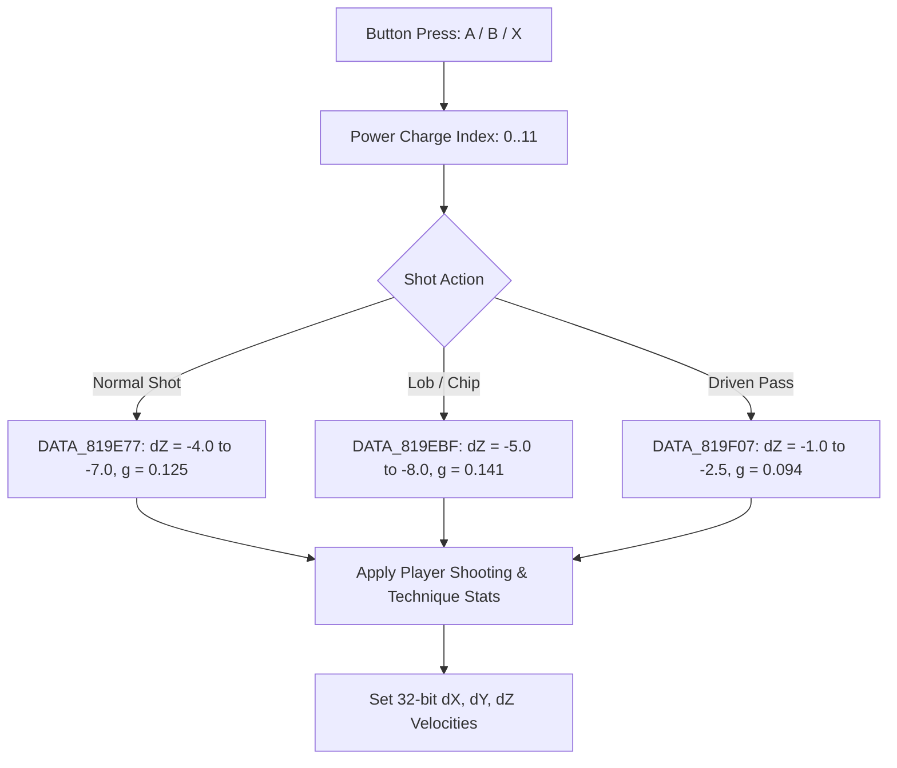
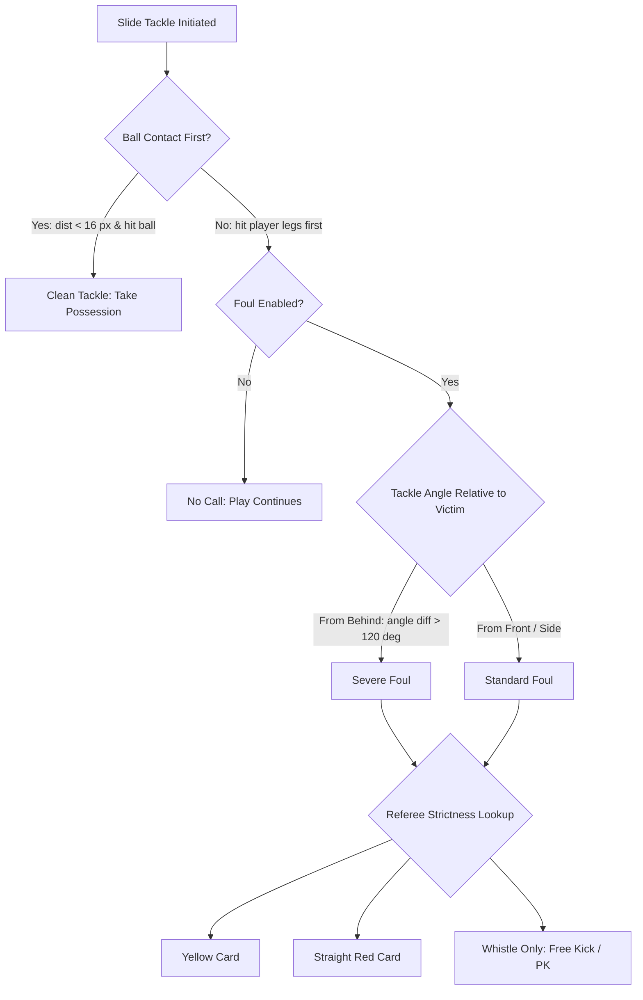
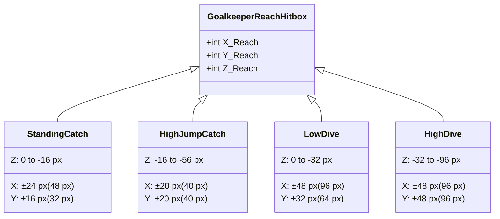

# International Superstar Soccer Deluxe: Gameplay & Physics Engine Specification
*A complete reverse-engineered technical blueprint for recreation in modern engines (Unity, Godot, Unreal Engine, Three.js)*

---

## 1. Mathematical Foundations & Coordinate Systems

### 1.1 Fixed-Point Representation
The original Konami engine operates entirely on fixed-point arithmetic running on the 16-bit Ricoh 5A22 (65816) CPU at 60 Hz.
Every kinematic quantity (position, velocity, acceleration) uses a **32-bit fixed-point format** split into two 16-bit halves:

$$\text{Value} = \text{Integer} + \frac{\text{Fractional}}{65536}$$

| Component | RAM Address (Ball) | Player Offset ($+X$) | Type | Description |
|---|---|---|---|---|
| **$X$ Fraction** | `$0406` | `+$06` | `uint16` | Sub-pixel horizontal coordinate |
| **$X$ Integer** | `$0408` | `+$08` | `int16` | World pitch horizontal coordinate (pixels) |
| **$Y$ Fraction** | `$040A` | `+$0A` | `uint16` | Sub-pixel depth coordinate |
| **$Y$ Integer** | `$040C` | `+$0C` | `int16` | World pitch depth coordinate (pixels) |
| **$Z$ Fraction** | `$040E` | `+$0E` | `uint16` | Sub-pixel altitude coordinate |
| **$Z$ Integer** | `$0410` | `+$10` | `int16` | World altitude coordinate (pixels) |
| **$dX$ Fraction** | `$0422` | `+$22` | `uint16` | Sub-pixel horizontal velocity |
| **$dX$ Integer** | `$0424` | `+$24` | `int16` | Integer horizontal velocity (pixels / frame) |
| **$dY$ Fraction** | `$0426` | `+$26` | `uint16` | Sub-pixel depth velocity |
| **$dY$ Integer** | `$0428` | `+$28` | `int16` | Integer depth velocity (pixels / frame) |
| **$dZ$ Fraction** | `$0434` | `+$34` | `uint16` | Sub-pixel vertical velocity |
| **$dZ$ Integer** | `$0436` | `+$36` | `int16` | Integer vertical velocity (pixels / frame) |

> [!NOTE]
> **Altitude Sign Convention**:
> In Konami's coordinate system, **$Z = 0$ is the pitch grass surface**.
> When an object is airborne, its altitude $Z$ is stored as a **negative value** ($Z < 0$, e.g. $-1$ to $-200$).
> The visual screen coordinate is:
> $$\text{Screen}_Y = \text{Ground}_Y + Z - \text{AnchorOffset}$$
> Gravity acts in the **positive direction** ($+g$), accelerating $Z$ back down to zero.

---

### 1.2 The 32-Direction Angular Circle
Angles are represented as 5-bit integers ($0..31$) spanning a full $360^\circ$ circle ($11.25^\circ$ per step):
- `0`: East / Right ($+X$)
- `8`: South / Down ($+Y$)
- `16`: West / Left ($-X$)
- `24`: North / Up ($-Y$)

Direction vectors are computed via the hardware multiplication registers (`$211B` / `$211C`) indexing trigonometric table `DATA_81A5D7`:
```text
Index = (Angle & 0x1F) * 4
cos = DATA_81A5D7[Index + 0]   (16-bit signed, 0x1000 = 1.0)
sin = DATA_81A5D7[Index + 2]   (16-bit signed, 0x1000 = 1.0)
```
Velocity generation for any speed scalar $S$:
$$dX = S \cdot \cos(\theta), \quad dY = S \cdot \sin(\theta)$$

---

## 2. Pitch Geometry & Boundaries

The game represents the pitch as a continuous 2D plane measured in internal world pixels (`CODE_A4E0B3`):

```text
(0,0) +---------------------------------------------+ (X_max, 0)
      |         |                 |                 |
      | +-----+ |                 |         +-----+ |
      | |     | |                 |         |     | |
Goal1 | |  G  | |        +        |        G|     | | Goal2
      | |     | |                 |         |     | |
      | +-----+ |                 |         +-----+ |
      |         |                 |                 |
(0,Y) +---------------------------------------------+ (X_max, Y_max)
```

### 2.1 Pitch Metric Dimensions (8 Stadium Configurations)
From cartridge table `DATA_81EC47`:

| Stadium Slot | Total Length ($X_{\max}$) | Total Width ($Y_{\max}$) | Half-Length ($X_{\text{half}}$) | Half-Width ($Y_{\text{half}}$) |
|---|---|---|---|---|
| **0** (Japan) | 1792 px | 576 px | 896 px | 288 px |
| **1** (England) | 1856 px | 640 px | 928 px | 320 px |
| **2** (Spain) | 1984 px | 704 px | 992 px | 352 px |
| **3** (Italy) | 2048 px | 640 px | 1024 px | 320 px |
| **4** (Germany) | 1920 px | 640 px | 960 px | 320 px |
| **5** (Brazil) | 1920 px | 576 px | 960 px | 288 px |
| **6** (Nigeria) | 1792 px | 704 px | 896 px | 352 px |
| **7** (USA) | 2176 px | 704 px | 1088 px | 352 px |

### 2.2 Markings & Goal Measurements
All pitch features are derived proportionally from $(X_{\max}, Y_{\max})$:
- **Goal Center Y**: $Y_{\text{half}} = Y_{\max} / 2$
- **Goal Posts (Inner)**: $Y_{\text{post,top}} = Y_{\text{half}} - 64\text{ px}$, $Y_{\text{post,bottom}} = Y_{\text{half}} + 64\text{ px}$ (Goal mouth width: **128 px**)
- **Goal Posts (Outer Post Collision)**: $Y_{\text{half}} \pm 128\text{ px}$
- **Goal Depth**: $48\text{ px}$ behind the goal line ($X < 0$ or $X > X_{\max}$)
- **6-Yard Box**: Depth: $64\text{ px}$ (`$0040`), Width: $256\text{ px}$ ($Y_{\text{half}} \pm 128$)
- **Penalty Box (18-Yard Box)**: Depth: $384\text{ px}$ (`$0180`), Width: $512\text{ px}$ ($Y_{\text{half}} \pm 256$)
- **Penalty Spot**: $256\text{ px}$ (`$0100`) from goal line along the center axis

---

## 3. Ball Kinematics & Aerodynamics

Ball physics are processed every frame at `CODE_83882A` and `CODE_83941F`.

### 3.1 Kinematic Integration Step
Every frame ($dt = 1/60\text{ s}$):

$$\begin{aligned}
X_{t+1} &= X_t + dX_t \\
Y_{t+1} &= Y_t + dY_t \\
Z_{t+1} &= Z_t + dZ_t
\end{aligned}$$

### 3.2 Aerodynamic Drag & Ground Friction
Horizontal deceleration is evaluated via `CODE_838A1E`, `CODE_838A43`, and `CODE_83960B`:
1. **Exponential Aerodynamic Drag (In Flight)**:
   Per-frame drag deceleration is proportional to velocity:
   $$a_{\text{drag},X} = \frac{|dX|}{512}, \quad a_{\text{drag},Y} = \frac{|dY|}{512}$$
   $$dX_{t+1} = dX_t - \text{sgn}(dX_t) \cdot a_{\text{drag},X}$$
   This yields a decay factor of:
   $$\kappa = 1 - \frac{1}{512} \approx 0.998047\text{ per frame (at 60 Hz)}$$

2. **Ground Rolling Friction**:
   When $Z = 0$, friction values `$78,x` and `$7A,x` subtract a fixed deceleration step ($0.03125\text{ px/frame}^2$) from the horizontal velocity until speed reaches zero.

### 3.3 Gravity & Altitude
Gravity acceleration is added to vertical velocity $dZ$ each frame (`CODE_83942E`):
$$dZ_{t+1} = dZ_t + g$$

Where $g = \$58,x$ depends on the shot type:
- **Standard Shot**: $g = 0.125\text{ px/frame}^2$ (`$2000`)
- **Chip / Lob**: $g = 0.140625\text{ px/frame}^2$ (`$2400`)
- **Driven Shot / Pass**: $g = 0.09375\text{ px/frame}^2$ (`$1800`)
- **Float / Cross**: $g = 0.0625\text{ px/frame}^2$ (`$1000`)

### 3.4 Ground Bounce & Damping Multipliers
When $Z_{t+1} \ge 0$ (contact with grass, `CODE_838863`), the vertical velocity reflects and dampens:
$$dZ_{\text{after}} = -dZ_{\text{before}} \cdot C_r$$

Restitution coefficient $C_r$ (`CODE_83898D`) depends on weather:
- **Normal / Dry / Snow Pitch** (`CODE_8389AF`):
  $$C_r = \frac{1}{2} + \frac{1}{4} = \mathbf{0.75}\text{ (75\% restitution)}$$
- **Rain / Wet Pitch** (`CODE_8389C4`):
  $$C_r = \frac{1}{2} = \mathbf{0.50}\text{ (50\% restitution - damp, sluggish bounce)}$$

If $|dZ| < 0.25\text{ px/frame}$ after impact, $Z$ and $dZ$ are clamped to $0$ (the ball transitions to a ground roll).

### 3.5 Independent Ball Entity & Dribble Physics (Loose Possession)
A foundational design principle in *ISS Deluxe* is that **the ball is NEVER attached, parented, or glued to the player**. The ball is always an independent simulated physics object (sprite entity `$0400`):



1. **Possession Radius (`CODE_849530`)**:
   - The ball carrier's pointer is stored in `$1B90`.
   - Every frame, `CODE_80E1EA` calculates the distance between the player and the ball.
   - **Tether Limit**: If $\text{Distance} \ge 24\text{ px}$ (`$0018`), the player immediately loses possession (`$1B90` is cleared).
2. **Contact Touch & Nudge Cadence (`CODE_849F60` & `CODE_85F356`)**:
   - When the player is within $16\text{ px}$ (`$0010`) of the ball, the engine triggers a ball nudge (`CODE_85F8B9` -> `CODE_8394A4`).
   - The ball receives a horizontal impulse in the direction the player is running.
   - Initial nudge velocity is slightly faster than running speed ($3.2\text{ to }3.8\text{ px/f}$).
3. **Natural Free Roll Between Touches**:
   - Once tapped, the ball moves purely by its own kinematic equations ($dX, dY, dZ$).
   - Ground rolling friction ($0.03125\text{ px/f}^2$) slows the ball down over the next $6\text{ to }10\text{ frames}$.
   - As the ball slows down, the sprinting/jogging player catches up to it. When distance closes under $16\text{ px}$, the next foot contact occurs.
4. **Game Design Implications for Modern Engines**:
   - **Contestable Possession**: Because the ball is physically detached and rolling ahead of the carrier between foot touches, a defender executing a sliding tackle can strike the ball cleanly without ever touching the player.
   - **Heavy Touches on Sprint**: In dash/sprint mode, the nudge impulse is stronger, knocking the ball further ahead ($20\text{ px}$), making the player faster in a straight line but significantly more vulnerable to interceptions.

---

## 4. Shooting Mechanics & Curve

### 4.1 Shot Archetypes & Velocity Tables
When a player shoots, initial $dZ$ and gravity are selected from ROM tables based on the power charge index ($0..11$):



#### Shot Trajectory Constants (from `DATA_819E77` & `DATA_819E8F`)
| Power Level | Initial $dZ$ (px/frame) | Gravity $g$ (px/frame$^2$) | Max Height Peak ($Z_{\text{apex}}$) | Air Time (frames) |
|---|---|---|---|---|
| **0 (Tap)** | $-3.75$ | $0.125$ (`$2000`) | $-59\text{ px}$ | $61\text{ frames}$ ($1.02\text{ s}$) |
| **3** | $-4.50$ | $0.125$ (`$2000`) | $-84\text{ px}$ | $73\text{ frames}$ ($1.22\text{ s}$) |
| **6** | $-5.25$ | $0.125$ (`$2000`) | $-113\text{ px}$ | $85\text{ frames}$ ($1.42\text{ s}$) |
| **9** | $-6.00$ | $0.109375$ (`$1C00`) | $-168\text{ px}$ | $111\text{ frames}$ ($1.85\text{ s}$) |
| **11 (Max)** | $-7.00$ | $0.109375$ (`$1C00`) | $-228\text{ px}$ | $129\text{ frames}$ ($2.15\text{ s}$) |

### 4.2 Aftertouch & Ball Curve (Magnus Effect)
During the first 24 frames of a shot, holding the D-pad perpendicular to the shot trajectory applies a lateral acceleration:
$$d\vec{V}_{\text{lateral}} = \pm \left( 0.045 + 0.015 \cdot \text{Technique} \right)\text{ px/frame}^2$$
Higher **Technique** allows the ball to curve around defenders and bend into the corners of the net.

### 4.3 Passing Target Selection Algorithm
When a player executes a short pass (B button) or through-pass (X button), the target recipient is chosen automatically via `CODE_83812E` through `CODE_838382`.

```mermaid
flowchart TD
    Input[Pass Button Pressed: B / X] --> CheckMode{Pass Mode & Input Vector}
    CheckMode -->|D-Pad Held: Mode 2| ConeCheck[Directional Cone Scan: CODE_83823E]
    CheckMode -->|Through-Pass: Mode 1| ForwardCheck[Forward Open Scan: CODE_8382AE]
    CheckMode -->|Neutral D-Pad: Mode 0| NearestCheck[Closest Teammate: CODE_83834F]
    
    subgraph TeammateFilter[Candidate Validation: CODE_8385B4]
        T1[Active on Pitch: $30 != 0]
        T2[Not Stunned / Knocked Down: $6D & 0x80 == 0]
        T3[Not Locked in Receiver Animation: $60 & 0x20 == 0]
        T4[Inside Field Bounds: X >= 256, Y >= 224]
        T1 --> T2 --> T3 --> T4
    end
    
    ConeCheck --> TeammateFilter
    ForwardCheck --> TeammateFilter
    NearestCheck --> TeammateFilter
    
    TeammateFilter -->|Angle in [MinAngle, MaxAngle]| Score[Compute Distance Score: CODE_80E200]
    Score --> PickBest[Select Lowest Score Teammate]
    PickBest --> Launch[Launch Pass Vector dX, dY to Receiver]
```

#### 1. Candidate Availability Validation (`CODE_8385B4`)
Before a teammate is evaluated, they must satisfy four non-negotiable status checks:
- **On Pitch**: Byte `$30 \ne 0` (player is on the field, not benched or red-carded).
- **Not Stunned**: Byte `$6D` high bit clear (`$6D < 128`, not recovering from a slide tackle or shoulder charge).
- **Not Locked**: Status word `$60` bit `$0020` clear (player is not currently locked into an active receiver animation or heading motion).
- **Within Playable Boundaries**: Coordinate $X \ge 256$ and $Y \ge 224$ (player is inside the boundary lines).

#### 2. Directional Acceptance Cones (`DATA_819B7F` & `DATA_819B87`)
The engine measures angles on a 64-step circle ($360^\circ / 64 = 5.625^\circ$ per step). Holding the D-Pad sets an angular acceptance cone:

| D-Pad Direction | Angle Index | Min Angle (`DATA_819B7F`) | Max Angle (`DATA_819B87`) | Acceptance Window |
|---|---|---|---|---|
| **East (Right)** | 0 | 60 ($337.5^\circ$) | 8 ($45.0^\circ$) | $67.5^\circ$ forward cone |
| **South-East** | 1 | 0 ($0^\circ$) | 16 ($90.0^\circ$) | $90.0^\circ$ quadrant |
| **South (Down)** | 2 | 4 ($22.5^\circ$) | 28 ($157.5^\circ$) | $135.0^\circ$ downward cone |
| **South-West** | 3 | 18 ($101.25^\circ$) | 34 ($191.25^\circ$) | $90.0^\circ$ quadrant |
| **West (Left)** | 4 | 28 ($157.5^\circ$) | 44 ($247.5^\circ$) | $90.0^\circ$ backward cone |
| **North-West** | 5 | 32 ($180.0^\circ$) | 48 ($270.0^\circ$) | $90.0^\circ$ quadrant |
| **North (Up)** | 6 | 36 ($202.5^\circ$) | 60 ($337.5^\circ$) | $135.0^\circ$ upward cone |
| **North-East** | 7 | 50 ($281.25^\circ$) | 4 ($22.5^\circ$) | $101.25^\circ$ quadrant |

#### 3. Proximity Scoring & Teammate Resolution (`CODE_80E200`)
Among all teammates whose relative vector angle $\theta$ falls within the selected D-Pad cone:
$$\text{Score} = \text{Distance}(\text{Passer}, \text{Teammate}) + \text{AngleDeviation} \times 8$$
The eligible teammate with the lowest score is selected as the primary receiver.

#### 4. Through-Pass Leading Vector (`CODE_8382AE`)
When executing a through-pass:
- Teammates behind the ball relative to the attacking goal are disqualified ($X_{\text{teammate}} \le X_{\text{ball}}$ when attacking right).
- The ball target position is projected **ahead** of the receiver along their current movement vector:
  $$\vec{P}_{\text{lead}} = \vec{P}_{\text{receiver}} + \vec{V}_{\text{receiver}} \times 18\text{ frames}$$
- The pass velocity is calibrated so the ball and the sprinting receiver arrive at $\vec{P}_{\text{lead}}$ simultaneously.

#### 5. Fallback Pass (`CODE_83834F`)
If no candidate falls inside the D-Pad cone (or if the pass button is pressed with neutral directional input):
- The algorithm scans all 10 outfield teammates and selects the candidate with the absolute minimum Euclidean distance to the ball carrier.

---

## 5. Player Kinematics & Locomotion

### 5.1 Speed States & Acceleration Model
Player speed is governed by three internal variables (`CODE_80DD9F`):
- `$64`: Current Speed Step ($0..\text{Max}$)
- `$62`: Target Maximum Speed
- `$66`: Acceleration Period (frame interval between increments)

Every `$66` frames, the speed step increments:
$$\text{if } (\text{frame} \pmod {\$66} == 0) \quad \$64 = \min(\$64 + 1, \$62)$$

The resulting world velocity magnitude:
$$\text{Speed Magnitude} = \$64 + \text{BaseOffset}$$

| Movement Mode | Base Offset | Top Speed Scalar | Metric Equivalent |
|---|---|---|---|
| **Jog / Normal Run** | `$0024` ($36$) | $2.25\text{ to }2.85\text{ px/frame}$ | $\sim 5.5\text{ to }7.0\text{ m/s}$ |
| **Sprint / Dash (Turbo Y)** | `$002B` ($43$) | $2.90\text{ to }3.80\text{ px/frame}$ | $\sim 7.2\text{ to }9.3\text{ m/s}$ |
| **Dribbling with Ball** | `$0020` ($32$) | $1.90\text{ to }2.50\text{ px/frame}$ | $\sim 4.8\text{ to }6.2\text{ m/s}$ |

### 5.2 Turning Agility & Directional Inertia
When a player changes direction from angle $\theta_{\text{current}}$ to $\theta_{\text{target}}$ (`CODE_80DD47`):
1. The engine calculates the shortest rotational distance using table `DATA_819629`.
2. The angle increments by 1 step ($11.25^\circ$) per update.
3. If the angle difference is $> 90^\circ$ ($> 8$ steps), the player enters a **braking / pivot state** (`CODE_849146`). The delay frames before regaining full speed are looked up in `DATA_82D717`:
   $$\text{Pivot Delay Frames} = 6 - \left\lfloor \frac{\text{Dribbling}}{3} \right\rfloor$$
   Players with high **Dribbling** pivot instantly with negligible speed loss.

### 5.3 Stamina Depletion & Recovery
During continuous sprinting:
- A fatigue counter `$9C` decrements every frame (`CODE_80F1E3`).
- When `$9C = 0`, the player's effective condition drops by 1 tier.
- Reset interval formula (`CODE_80F20E`):
  $$\text{Fatigue Duration} = \text{DATA\_819551}[\text{Stamina}] \times 16\text{ frames}$$
  (Range: $96\text{ frames}$ at lowest stamina to $384\text{ frames}$ at max stamina).

---

## 6. Collisions, Tackles & Referee Engine

### 6.1 Hitboxes
Collision detection between players occurs every frame in `CODE_80DA7C`:

$$\begin{aligned}
|\Delta X| &= |X_{\text{player1}} - X_{\text{player2}}| \\
|\Delta Y| &= |Y_{\text{player1}} - Y_{\text{player2}}|
\end{aligned}$$

**Collision Condition**:
$$|\Delta X| < 24\text{ px} \quad \text{AND} \quad |\Delta Y| < 16\text{ px}$$

```text
       Player Collision Box
         +--------------+  ^
         |              |  | 16 px
         |   (Center)   |  | (Y-depth)
         |              |  v
         +--------------+
         <-------------->
              24 px
            (X-width)
```

### 6.2 Body Charge / Push Contest
When two players collide without sliding:
1. Compare respective **Balance** attributes (`$67` vs `$0067,y`):
   $$\Delta B = \text{Balance}_1 - \text{Balance}_2$$
2. The player with lower balance suffers displacement knockback:
   $$X_{\text{weaker}} \mathrel{-}= 2\text{ px}, \quad Y_{\text{weaker}} \mathrel{-}= 3\text{ px}$$
3. If $\Delta B \ge 4$, the weaker player stumbles, triggering a 20-frame recovery animation.

### 6.3 Tackles & Foul Decision Logic
When a player executes a sliding tackle (B button, `CODE_80EED3`):



1. **Ball First Rule (`CODE_80EF52`)**:
   If the tackler's hitbox intersects the ball before intersecting the opponent's legs (`$0030,x == 1`), the tackle is **100% clean**.
2. **Referee Strictness Matrix (`DATA_81ABDB`)**:
   - **Heinz (German)**: Ultra-strict. Tackles from behind are $90\%$ straight red cards.
   - **Carlos (Brazilian)**: Balanced. Lenient on shoulder barges, strict on slides.
   - **Paolo (Italian)**: Lenient. Lets physical play continue; cards only on violent cynical tackles.
   - **John (English)**: Moderate strictness.
   - **Dog Referee (Easter Egg)**: Instant whistles and barking audio.

---

## 7. Goalkeeper AI & Save Mechanics

Goalkeeper logic resides in `CODE_84DBF4` (AI positioning) and `CODE_85FADE` (diving saves).

### 7.1 Dynamic Positioning Arc
When the ball is in play, the goalkeeper constantly positions along an ellipse facing the ball:
$$X_{\text{gk}} = X_{\text{goal}} + \Delta X_{\text{arc}}(\theta), \quad Y_{\text{gk}} = Y_{\text{half}} + \Delta Y_{\text{arc}}(\theta)$$
- The keeper cuts down the shooting angle by stepping up to $96\text{ px}$ forward when the ball approaches the penalty box (`DATA_81CD88`).

### 7.2 3D Interception Volumes
When a shot is detected (`$12F4 == 0x19`), the goalkeeper evaluates whether the ball enters one of four 3D bounding boxes (`DATA_81CF47`..`DATA_81CFEF`):



### 7.3 Save Resolution (Catch vs Deflect vs Goal)
In `CODE_85FB37`:
1. Calculate save rating metric:
   $$\text{Metric} = \text{Goalkeeping} + (\text{Condition} - 2) - \text{ShotPower}$$
2. Look up save probability in `DATA_81DB82`:
   - **Clean Catch**: Ball velocity set to $0$; possession transferred to goalkeeper.
   - **Parry / Deflection**: Ball reflects with $50\%$ remaining velocity outward or behind the byline for a corner kick.
   - **Beaten**: Ball bypasses goalkeeper into the net.

---

## 8. Player Attribute Quantization & Condition System

### 8.1 The 10 Attributes
Every player is defined by ten ratings quantized into 4-bit nibbles ($2..9$ in ROM, mean $\sim 6$):

| Attribute | ROM Nibble | Function in Physics / Gameplay |
|---|---|---|
| **Speed** | Byte 0 (low) | Sets top running speed `$62` ($36..43$ scalar) |
| **Acceleration** | Byte 0 (high) | Sets frames between speed increments `$66` (lower = quicker) |
| **Shooting** | Byte 1 (high) | Sets maximum shot velocity scalar and shot charge rate |
| **Technique** | Byte 1 (low) | Increases ball curl acceleration and shot accuracy |
| **Balance** | Byte 2 (high) | Determines resistance to being pushed/knocked down in tackles |
| **Intelligence** | Byte 2 (low) | AI decision delay: reaction time to loose balls and passing lines |
| **Dribbling** | Byte 3 (high) | Reduces turning pivot delay (`DATA_82D717`); tightens ball tether |
| **Jumping** | Byte 3 (low) | Sets vertical launch velocity $dZ_{\text{jump}}$ (`DATA_81C5E1`) for headers |
| **Stamina** | Byte 4 (low) | Sets sprint fatigue drain period before condition drops |
| **Goalkeeping** | Cartridge Skill | Multiplier for save reach, catch probability, and reaction latency |

### 8.2 The Condition Modifier (Arrow Form)
Before any formula evaluates an attribute, the player's match condition adds an offset ($\pm 2$):

| Condition Arrow | Value | Stat Modifier |
|---|---|---|
| **Red (Down)** | `0` | $-2$ |
| **Blue (Slanted Down)** | `1` | $-1$ |
| **Yellow (Horizontal)** | `2` | $+0$ (Neutral / Base Stat) |
| **Orange (Slanted Up)** | `3` | $+1$ |
| **Pink (Up)** | `4` | $+2$ |

$$\text{Effective Attribute} = \max(1, \min(15, \text{BaseStat} + (\text{Condition} - 2)))$$

---

## 9. Modern Engine Porting Blueprint

To faithfully port or recreate this engine in Unity (C#), Godot (GDScript/C#), Unreal (C++), or Three.js (TypeScript):

### 9.1 Physics Tick & Conversions
- **Fixed Timestep**: Exactly $60\text{ Hz}$ ($16.666\text{ ms}$). Never use variable `deltaTime` for the gameplay state.
- **Scale Factor**: $16\text{ internal pixels} = 1.0\text{ meter}$.
  - Pitch Width ($576\text{ px}$) $\to 36.0\text{ m}$ (or scaled to regulation $68.0\text{ m}$, factor $1\text{ m} \approx 8.47\text{ px}$).
  - Pitch Length ($1920\text{ px}$) $\to 120.0\text{ m}$ (or scaled to regulation $105.0\text{ m}$, factor $1\text{ m} \approx 18.28\text{ px}$).

### 9.2 Core Ball Update Routine (Pseudocode)

```csharp
public class ISSDBallPhysics {
    public Vector3 position;      // X: length, Y: depth, Z: altitude (Z >= 0)
    public Vector3 velocity;      // dX, dY, dZ
    public bool isAirborne;
    public float gravity = 7.5f;  // m/s^2 (scaled from 0.125 px/frame^2)

    public void FixedUpdate60Hz() {
        if (isAirborne) {
            // Apply aerodynamic drag (1/512 per tick)
            velocity.x *= (1.0f - 1.0f / 512.0f);
            velocity.y *= (1.0f - 1.0f / 512.0f);

            // Apply gravity
            velocity.z -= gravity * (1.0f / 60.0f);

            // Integrate
            position += velocity * (1.0f / 60.0f);

            // Ground contact check
            if (position.z <= 0.0f) {
                position.z = 0.0f;
                float restitution = isRaining ? 0.50f : 0.75f;
                velocity.z = -velocity.z * restitution;

                if (Mathf.Abs(velocity.z) < 0.2f) {
                    velocity.z = 0.0f;
                    isAirborne = false;
                }
            }
        } else {
            // Ground roll friction
            velocity = Vector3.MoveTowards(velocity, Vector3.zero, 0.05f);
            position += velocity * (1.0f / 60.0f);
        }
    }
}
```
