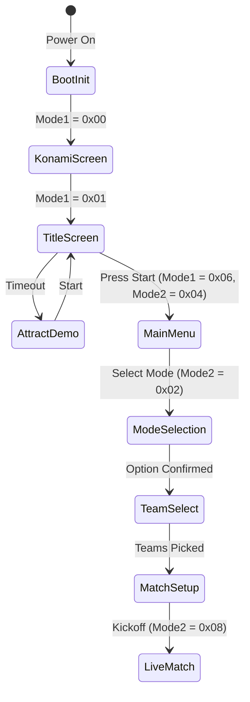

# ISSD Native — Menus, Screens & User Interface Architecture

This document describes the menu navigation state machines, UI tilemaps, font rendering, and team setup flows in *International Superstar Soccer Deluxe Native*.

---

## 1. Top-Level Scene Flow



---

## 2. The 8 Main Menu Modes

When `RAM_ISSD_CURRENT_GAME_MODE1 = 0x06` and `RAM_ISSD_CURRENT_GAME_MODE2 = 0x04`, `CODE_80AF94` dispatches menu initialization. The pointer table `DATA_81E98F` defines the 8 menu options:

| Index | Mode Name | Description | Key Assets Decompressed |
| :---: | :--- | :--- | :--- |
| **0** | **Open Game** | Friendly exhibition match (1P vs 2P, 1P vs CPU, CPU vs CPU, PK) | `DATA_8285EB` -> `DATA_998182` |
| **1** | **International Cup** | Tournament mode representing the World Cup | `DATA_82863F` -> `DATA_9AD17F` |
| **2** | **World Series** | Extended season league against all major teams | `DATA_82868F` -> `DATA_9ADD21` |
| **3** | **Training** | Skill training (Dribbling, shooting, corner kicks, defense) | `DATA_8286E3` -> `DATA_9F8000` |
| **4** | **Scenario** | 12 historic scenarios where the player must overcome a deficit | `DATA_828747` -> `DATA_9FDA53` |
| **5** | **Penalty Kick** | Shootout competition with customized keepers | `DATA_8287AB` -> `DATA_A0956A` |
| **6** | **Options** | Game time (3..7 min), difficulty, foul severity, audio settings | `DATA_828819` -> `DATA_A0F12B` |
| **7** | **Password** | 16-character alphanumeric password restore system | `DATA_828873` -> `DATA_A2DEE3` |

### Menu Asset Loading (`CODE_A4A946`)
```asm
CODE_A4A94F:
    LDA.w $19A2                                ; Active menu option index (0..7)
    ASL
    TAY
    LDX.w DATA_81E98F,y                        ; Load option asset package pointer
    JSL.l CODE_80B527                          ; Decompress graphics to $7E:2000
    LDX.w #DATA_828B57                         ; Load menu frame and border tilemap
    JSL.l CODE_80B527                          ; Decompress to VRAM
    RTL
```

---

## 3. Team Selection & Morale System

### Team Selection Grid
Teams are organized into geographic confederations across multiple pages (`RAM_ISSD_TeamSelectScreen_NumberOfPages = $7ED472`):
- **Page 1:** Western European Giants (Germany, Italy, England, Holland, Spain, France)
- **Page 2:** Central & Eastern Europe (Croatia, Bulgaria, Russia, Sweden, Romania)
- **Page 3:** The Americas (Brazil, Argentina, Colombia, Mexico, USA, Uruguay)
- **Page 4:** Asia & Africa (Japan, South Korea, Nigeria, Cameroon, Morocco)
- **Secret Teams:** All-Star, Euro Stars, Asian Stars, African Stars, All-American Stars

### Player Morale Indicators ("Smiley Faces")
Each player's in-game conditioning is represented by an animated smiley face sprite:
- **Purple (Very Poor):** Stat penalty (-20% speed/power)
- **Blue (Poor):** Minor stat penalty (-10%)
- **Yellow (Normal):** Base player stats
- **Orange (Good):** Minor stat boost (+10%)
- **Pink (Superb):** Maximum stat boost (+25% sprint/accuracy)

The smiley face graphics reside at `$9E899E` - `$9E8D1C` and are dynamically mapped into OAM slots.

---

## 4. UI Layering & Font Architecture

- **Layer 3 (Text & Chrome):** Uses a dedicated 2 bpp character font at `$9DFA70` (`GFX_Layer3_MainMenus_VariousTextStrings`). Layer 3 tilemaps are updated directly in WRAM and transferred via V-Blank DMA.
- **Selection Cursors (Sprites):** Animated triangular cursors (`GFX_Sprite_MainMenus_Triangle1` at `$9BA3E9`) and highlight bounding boxes are driven by the OAM table at `$00:01E0`.
- **Match HUD (Layer 3):** During matches, Layer 3 is centered over the 16:9 widescreen canvas, maintaining the authentic positioning of the score box, timer, player stamina meters, and radar minimap.
