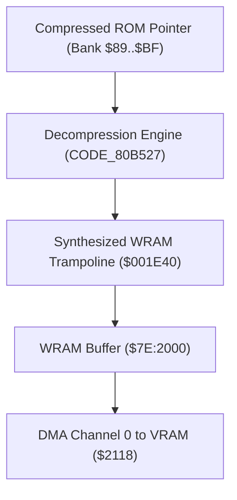

# ISSD Native — Graphics & Asset Rendering Pipeline

This document details the graphics decompression, palette management, metatile pitch streaming, and PPU rendering pipeline of *International Superstar Soccer Deluxe Native*.

---

## 1. Decompression Subsystem (`CODE_80B527`)

Konami compressed the majority of character tile sets, backgrounds, and full-screen tilemaps using a specialized variant of LZ77 / LZSS with block-move instructions.



### The Dynamic MVN Trampoline (`$001E40`)
The decompressor does not use a byte-by-byte copy loop. Instead, `CODE_80BE68` dynamically synthesizes an `MVN` routine in Low WRAM:

| Address | Opcode / Value | 65816 Assembly | Description |
| :--- | :--- | :--- | :--- |
| `$001E40` | `0x54` | `MVN <dst>, <src>` | 65816 Block Move instruction |
| `$001E41` | `0x7E` | `db $7E` | Destination bank (WRAM) |
| `$001E42` | dynamic | `db <src_bank>` | Source bank (read from pointer `$0C`) |
| `$001E43` | `0x6B` | `RTL` | Return from subroutine long |

The routine is invoked via `JSL.l $001E40` at:
- `CODE_80B969` (lines 8234 in disasm, line 254 in `bank00_part07_v2.c`)
- `CODE_80BD05` (lines 8780 and 8811 in disasm)

In native recompilation, this trampoline is modeled by `snes_execute_ram_mvn_trampoline(CpuState *cpu)` in [`recomp/generated/bank00_part07_v2.c`](file:///c:/Users/sergi/Homestead/code/isssdeluxe-recomp/recomp/generated/bank00_part07_v2.c).

---

## 2. Palette Engine & Direct Page Trampoline (`CODE_80A976`)

Color palettes are stored across ROM Bank `$89`. The game updates CGRAM via an intermediary 512-byte WRAM mirror at `!RAM_ISSD_Global_PaletteMirror` (`$7E:2C00`).

### The Direct Page Trampoline (`$000008`)
To transfer palette chunks with zero CPU overhead, `CODE_80A976` and `CODE_80A9CA` write a dynamic machine code stub directly into **Direct Page memory**:

```asm
CODE_80A976:
    LDA.w #$00A0
    STA.b $08                                ; $08: A0 <dest_lo> (LDY #dest)
    LDA.w #((!RAM_ISSD_Global_PaletteMirror&$FF0000)>>8)+$54
    STA.b $0B                                ; $0B: 54 7E (MVN $7E, <src_bank>)
    LDA.w #$6000
    STA.b $0D                                ; $0D: <src_bank> 60 (RTS)
    ...
    JSR.w $000008                            ; Execute synthesized Direct Page routine
```

In native recompilation, this trampoline is modeled by `snes_execute_dp_mvn_trampoline(CpuState *cpu)` in [`recomp/generated/bank00_part05_v2.c`](file:///c:/Users/sergi/Homestead/code/isssdeluxe-recomp/recomp/generated/bank00_part05_v2.c).

---

## 3. Pitch & Stadium Metatile Streaming

During live gameplay, the soccer field is far larger than the SNES PPU's 512x512 tilemap ring buffer. The game continuously streams new rows and columns as the camera pans:

```
World Field Space (Bank 7F)                      PPU 512x512 Tilemap Ring
+------------------------------------+          +--------------------+
| Metatile Map ($7FD000)             |          | Quadrant 0 | Quad 1|
| 32x32 Metatiles ($7F8000)          | -------> | (Pitch)    |       |
|                                    |          |------------+-------|
| Stride: $7FFFCC (from $81EE71)     |          | Quad 2     | Quad 3|
+------------------------------------+          +--------------------+
```

### Key Streamer Routines
- **`CODE_8B85E3` (Row Streamer):** Evaluates camera vertical movement and updates wrapping horizontal scan rows in the VRAM tilemap.
- **`CODE_8B86E9` (Column Streamer):** Evaluates horizontal movement and updates wrapping columns with lookahead (~32 pixels).
- **`CODE_8B87E7` (World Metatile Resolver):** Computes the metatile address:
  $$\text{Offset} = (Y \gg 8) \times \text{Stride} + ((Y \ \& \ 0\text{xE0}) \gg 2) + (X \gg 8) \times 64 + ((X \ \& \ 0\text{xFF}) \gg 5)$$
- **`CODE_8B8838` (Quadrant Selector):** Selects which of the four PPU nametable quadrants receives the DMA payload.

---

## 4. PPU Layers & 16:9 Widescreen Pipeline

During live matches, the SNES operates in **Mode 1** (`bgmode = 9` -> Mode 1 with BG3 priority enabled):

| Layer | SNES Purpose | Bit Depth | Widescreen Behavior |
| :--- | :--- | :--- | :--- |
| **BG1** | Field Turf / Pitch Markings | 4 bpp (16 colors) | Expanded horizontally from 256 to 398 px via metatile synthesis in `issd_widescreen.c`. |
| **BG2** | Stadium, Audience, Goalposts | 4 bpp (16 colors) | Expanded horizontally to match full widescreen aspect. |
| **BG3** | Scoreboard, Clock, Radar, Names | 2 bpp (4 colors) | Clamped to the authentic 256-pixel center column. |
| **OBJ** | Players, Goalkeepers, Ball, Shadows | 4 bpp (16 colors) | Sprite limits unlocked via `kPpuRenderFlags_NoSpriteLimits`. |

---

## 5. Master Asset Pointer Table

Extracted from [`AssetPointersAndFiles.asm`](file:///c:/Users/sergi/Homestead/code/isssdeluxe-recomp/deps/ISSD-disassembly/International_Superstar_Soccer_Deluxe/AsarScripts/AssetPointersAndFiles.asm):

### Uncompressed Graphics
- `$8CD6CA` - `$8CDF6A`: Camera operators behind advertising walls
- `$90FE0C` - `$90FE8C`: Referee yellow and red cards
- `$97CD58` - `$97F458`: In-game player hair styles
- `$98C5D4` - `$98E5D4`: Player jersey striping and collar patterns
- `$98E5D4` - `$98F014`: Jersey back numbers (1..11)
- `$999A63` - `$99E983`: Soccer net mesh and goal frames
- `$9A8000` - `$9A8600`: Soccer ball (rotation frames)
- `$9A8600` - `$9A8660`: Soccer ball shadow
- `$A2EB21` - `$A2ED81`: Large match score digits

### Compressed Graphics
- `$90F6D8` - `$90FB71`: Team statistics and performance bar graphs
- `$95FBDC` - `$95FF90`: Main menu UI icons, button chrome, borders
- `$9BA2E6` - `$9BA3D0`: Formation player position tokens (4-4-2, 4-3-3, etc.)
- `$9DDAA0` - `$9DE13C`: Directional cursor triangles and UI buttons
- `$9E8000` - `$9E865C`: Large typographic font glyphs
- `$9ED8AB` - `$9EE218`: Main menu background gradient and stadium graphic

### Palettes
- `$89C7F6`: Main menu button and icon palette
- `$89E272` - `$89E2B4`: Controller configuration icons
- `$89E40A` - `$89E44E`: Player morale smiley face icons (Purple, Yellow, Orange, Pink, Blue)
- `$89E49E` - `$89E4E0`: Main menu stadium backgrounds (Blue & Red variants)
- `$89F588` - `$89F652`: Intro cutscene players, spotlight, television static effect
