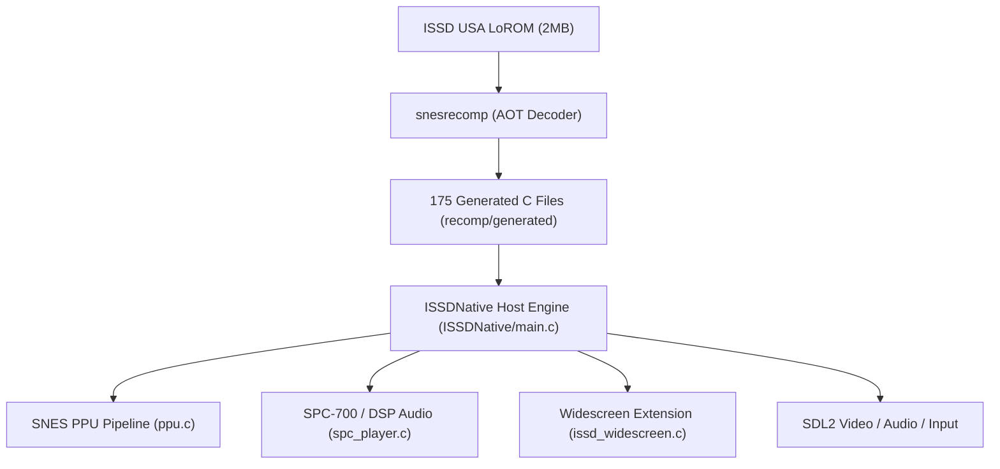
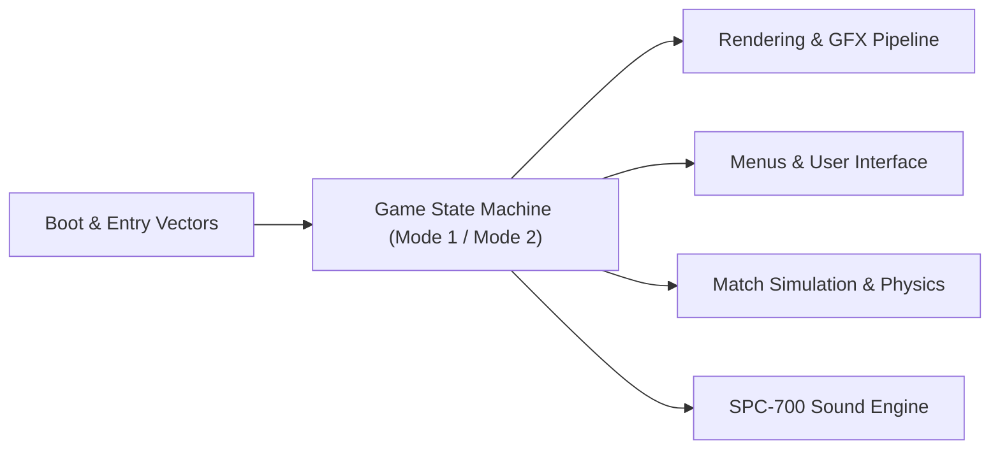

# ISSD Native — System Architecture & Reverse Engineering Manual

This document provides a comprehensive technical overview of **International Superstar Soccer Deluxe Native** (SNES USA). It is written to allow any AI agent or software engineer to rapidly understand the engine lifecycle, memory layout, subsystem boundaries, and code symbols.

---

## 1. System Overview & Platform Execution

*ISSD Native* is a statically recompiled C port of the Super Nintendo Entertainment System (SNES) title *International Superstar Soccer Deluxe* (USA, 16 Mbit / 2 MB LoROM).

### Execution Model
- **Simulation Frequency:** 60 Hz deterministic guest simulation loop (`RtlRunFrame`).
- **PPU Renderer:** Authentic scanline-based SNES PPU renderer (`kPpuRenderFlags_NewRenderer`) with true horizontal widescreen support (expanded from 256x224 to 398x224).
- **Audio:** Real-time SPC-700 cycle scheduler + DSP sample streaming (`RtlRenderAudio`).
- **Semantic Symbols:** Defined in [`ISSDNative/issd_symbols.h`](file:///c:/Users/sergi/Homestead/code/isssdeluxe-recomp/ISSDNative/issd_symbols.h).

---

## 2. Memory Architecture

The SNES memory map consists of 24-bit addresses (`Bank:Offset`). The game uses the **LoROM** memory mapping mode:

| Memory Region | Address Space | Size | Subsystem / Content |
| :--- | :--- | :--- | :--- |
| **Direct Page** | `$00:0000` - `$00:00FF` | 256 B | Zero-page variables, fast pointers, dynamic palette trampoline (`$00:0008`) |
| **CPU Stack** | `$00:0100` - `$00:01FF` | 256 B | 65816 Call stack and register preservation (`S` starts at `$01AF`) |
| **Low WRAM** | `$00:0200` - `$00:1FFF` | 7.5 KB | Game state, joypad, OAM mirror (`$01E0`), camera scroll, physics tables |
| **Decompression Trampoline** | `$00:1E40` - `$00:1E43` | 4 B | Dynamic WRAM `MVN` block-transfer engine for compressed assets |
| **Extended WRAM** | `$7E:2000` - `$7E:FFFF` | 56 KB | Palette mirror (`$7E:2C00`), VRAM upload queue (`$7E:3200`), sound staging |
| **Extended WRAM (Bank 7F)** | `$7F:0000` - `$7F:FFFF` | 64 KB | World pitch metatiles (`$7F8000`), BG1 grid (`$7FD000`), BG2 grid (`$7FE000`) |
| **ROM Banks ($80..$9F)** | `$80:8000` - `$9F:FFFF` | 1 MB | FastROM mirror: Engine code, physics, AI logic, decompression |
| **ROM Banks ($A0..$BF)** | `$A0:8000` - `$BF:FFFF` | 1 MB | Graphics data, audio BRR voice samples, compressed tilemaps, text fonts |

---

## 3. High-Level Subsystems

### 1. Boot & State Machine
The game state is controlled by two primary registers in Direct Page memory:
- **`RAM_ISSD_CURRENT_GAME_MODE1` (`$0032`)**: High-level system scene:
  - `0x00`: Boot sequence, Konami ribbon screen, hardware reset.
  - `0x01`: Attract mode, title screen, opening sequence.
  - `0x03`: Attract exhibition demo match.
  - `0x06`: Active interactive modes (Main Menu, Team Setup, Live Match).
- **`RAM_ISSD_CURRENT_GAME_MODE2` (`$0070`)**: Subsystem action state:
  - `0x00`: Idle / screen transition.
  - `0x02`: Interactive menu cursor navigation.
  - `0x04`: Menu screen initialization.
  - `0x08`: Live match gameplay simulation (players, ball, referee, camera).
  - `0x0A`: In-game pause menu overlay.
  - `0x0C`: Match pre-game asset loading (stadium, pitch, team jerseys).

### 2. Asset Rendering Pipeline (See [RENDERING_AND_GFX.md](file:///c:/Users/sergi/Homestead/code/isssdeluxe-recomp/docs/RENDERING_AND_GFX.md))
- **Asset Decompression (`CODE_80B527`):** Custom Konami LZ compression scheme. Decompresses graphics and tilemaps into WRAM.
- **Palette Transfer Engine (`CODE_80A976` / `CODE_80A9CA`):** Uses a synthesized `MVN` trampoline in Direct Page (`$000008`) to copy color tables from ROM Bank `$89` into CGRAM mirror `$7E:2C00`.
- **Widescreen Camera & Pitch Streaming (`issd_widescreen.c`):** Dynamically reconstructs stadium columns and pitch borders outside the native 256-pixel viewport during live matches.

### 3. Menus & User Interface (See [MENUS_AND_UI.md](file:///c:/Users/sergi/Homestead/code/isssdeluxe-recomp/docs/MENUS_AND_UI.md))
- **8-Option Main Menu:** Open Game, International Cup, World Series, Training, Scenario, Penalty Kick, Options, Password.
- **Team Selection & Rosters:** 36 national teams, continental all-star teams, and challenge mode teams.
- **UI Layers:** Layer 3 is dedicated to HUD, menus, fonts, and dialog boxes; Sprites (OAM) are used for icons, cursors, and difficulty stars.

### 4. Audio Engine (See [AUDIO_SYSTEM.md](file:///c:/Users/sergi/Homestead/code/isssdeluxe-recomp/docs/AUDIO_SYSTEM.md))
- **SPC-700 Co-processor:** Runs an independent sound driver in 64 KB audio RAM (ARAM).
- **APU Ports (`$2140`..`$2143`):** 4 bi-directional registers for command submission, music queuing (`CODE_80BF05`), and sample streaming (`CODE_80BF76`).
- **Streamed BRR Voice Samples:** High-quality announcer lines ("Goal!", "He Shoots!", "Corner Kick!", "Yellow Card!").

---

## 4. Key Developer & AI Navigation Guide

When extending or fixing bugs in *ISSD Native*, consult the specialized guides:
1. **Graphics, Palettes, & Sprites:** Refer to [`docs/RENDERING_AND_GFX.md`](file:///c:/Users/sergi/Homestead/code/isssdeluxe-recomp/docs/RENDERING_AND_GFX.md)
2. **Menus, Options, & Roster Screens:** Refer to [`docs/MENUS_AND_UI.md`](file:///c:/Users/sergi/Homestead/code/isssdeluxe-recomp/docs/MENUS_AND_UI.md)
3. **Music, SFX, & Announcer Voices:** Refer to [`docs/AUDIO_SYSTEM.md`](file:///c:/Users/sergi/Homestead/code/isssdeluxe-recomp/docs/AUDIO_SYSTEM.md)
4. **All Memory Addresses:** Refer to [`docs/RAM_MAP.md`](file:///c:/Users/sergi/Homestead/code/isssdeluxe-recomp/docs/RAM_MAP.md)
5. **Code Functions & Addresses:** Refer to [`docs/ROUTINE_MAP.md`](file:///c:/Users/sergi/Homestead/code/isssdeluxe-recomp/docs/ROUTINE_MAP.md)
6. **C Header Symbol Aliases:** Include [`ISSDNative/issd_symbols.h`](file:///c:/Users/sergi/Homestead/code/isssdeluxe-recomp/ISSDNative/issd_symbols.h) in native host code.
